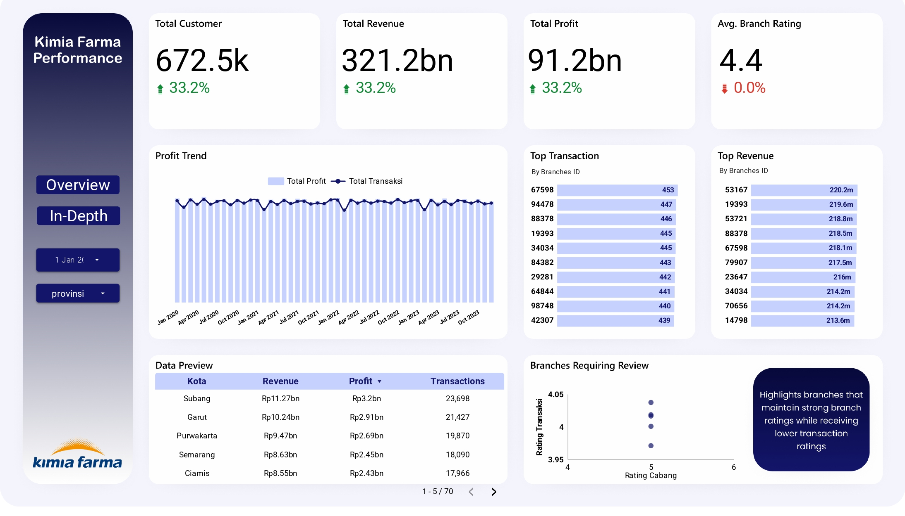
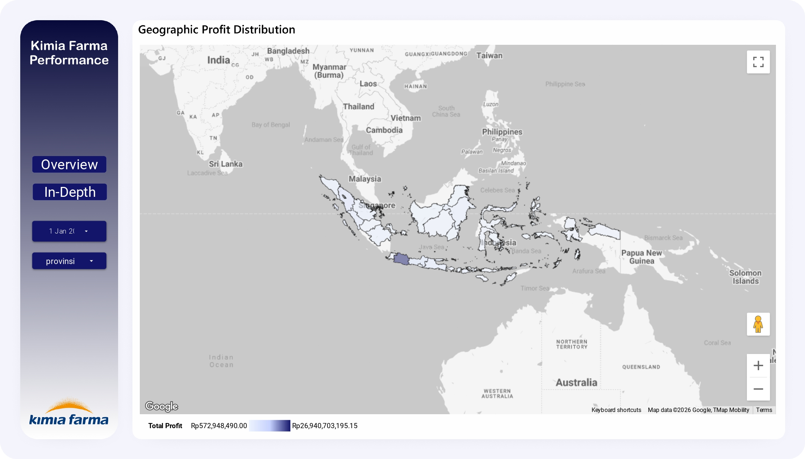

# Kimia Farma Business Performance Analysis (2020–2023)

## 📌 Project Overview

This project was developed as part of the **Kimia Farma Big Data Analytics Project Based Internship** by Rakamin Academy.

The objective of this project is to transform raw transactional data from Kimia Farma into an analytical dataset that can be used for business intelligence, dashboard development, and performance monitoring.

The final dataset integrates transaction, branch, and product information while calculating key business metrics such as:

- Nett Sales
- Gross Profit Percentage
- Nett Profit
- Branch Rating
- Transaction Rating

The resulting dataset serves as the primary data source for building interactive dashboards in **Google Looker Studio**.

---

## 🎯 Business Objectives

The analytical dataset was created to support:

- Business performance monitoring
- Revenue and profit analysis
- Branch performance evaluation
- Customer transaction analysis
- Geographic profit distribution analysis
- Executive dashboard development

---

## 🛠️ Technologies Used

- Google BigQuery
- SQL
- Google Looker Studio

---

## 📈 Data Processing Workflow

### Step 1 — Data Cleaning

The transaction date field is converted into a valid DATE format using:

```sql
PARSE_DATE('%m/%d/%E4Y', date)
```

---

### Step 2 — Data Integration

The transaction table is joined with:

- Branch table
- Product table

using:

```sql
LEFT JOIN
```

operations.

---

### Step 3 — Nett Sales Calculation

Nett Sales are calculated using:

```sql
price × (1 - discount_percentage)
```

Formula:

```sql
(p.price * (1 - t.discount_percentage))
```

---

### Step 4 — Gross Profit Classification

Gross profit percentage is assigned based on product price categories:

| Product Price | Gross Profit |
|---------------|-------------|
| ≤ 50,000 | 10% |
| 50,001 – 100,000 | 15% |
| 100,001 – 300,000 | 20% |
| 300,001 – 500,000 | 25% |
| > 500,000 | 30% |

---

### Step 5 — Nett Profit Calculation

Nett Profit is calculated using:

```sql
Nett Sales × Gross Profit Percentage
```

Formula:

```sql
((p.price * (1 - t.discount_percentage)) * gross_profit_percentage)
```

---

## 📋 Final Dataset Schema

| Column | Description |
|----------|-------------|
| transaction_id | Unique transaction identifier |
| transaction_date | Transaction date |
| branch_id | Branch identifier |
| branch_name | Branch name |
| branch_category | Branch category |
| kota | Branch city |
| provinsi | Branch province |
| rating_cabang | Branch rating |
| customer_name | Customer name |
| product_id | Product identifier |
| product_name | Product name |
| product_category | Product category |
| harga_asli_produk | Original product price |
| discount_percentage | Discount percentage |
| nett_sales | Sales after discount |
| persentase_gross_laba | Gross profit percentage |
| nett_profit | Final profit |
| rating_transaksi | Transaction rating |

---

## 📌 Key Metrics Produced

### Revenue

```sql
SUM(nett_sales)
```

### Profit

```sql
SUM(nett_profit)
```

### Transactions

```sql
COUNT(DISTINCT transaction_id)
```

### Average Branch Rating

```sql
AVG(rating_cabang)
```

### Average Transaction Rating

```sql
AVG(rating_transaksi)
```

---

## 📊 Dashboard Development

The resulting dataset was used to build a business performance dashboard consisting of:

- KPI Cards
  - Total Customer
  - Total Revenue
  - Total Profit
  - Average Branch Rating

- Profit Trend Analysis

- Top 10 Branches by Transaction

- Top 10 Branches by Revenue

- Branches Requiring Review

- Geographic Profit Distribution

---

## 📷 Dashboard Preview

### Dashboard Overview



### Geographic Profit Distribution



---

## 👨‍💻 Author

**Bilal Muhammad Thalib**

Kimia Farma Big Data Analytics Project Based Internship  
Rakamin Academy
